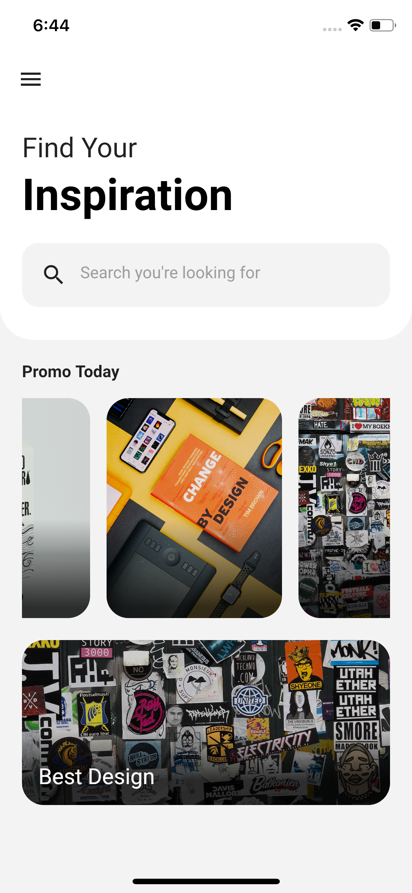

## Flutter Inspiration App UI Design - Day 1

```dart
class Day1 extends Flutter100DaysOfCode {
  video() {
    return {
      "title": "Flutter UI Concept App Design",
      "description": "Let's work with ListView in an example application.",
      "day": 1,
      "videoLink": "#"
    }
  }
}
```

## Previous Designs
[Checkout my LinkedIn account](https://www.linkedin.com/feed/update/urn:li:activity:7028671796132368384/)


## Development Setup
Clone the repository and run the following commands:
```
flutter pub get
flutter run
```

## ScreenShots

 &nbsp; 


## Links

* [LinkedIn](https://www.linkedin.com/in/patrick-wilfried-kamelan-2b388a115/)
* [Twitter](https://twitter.com/KamelanPatrick)
* [Instagram](https://www.instagram.com/patrickispoppin/)
